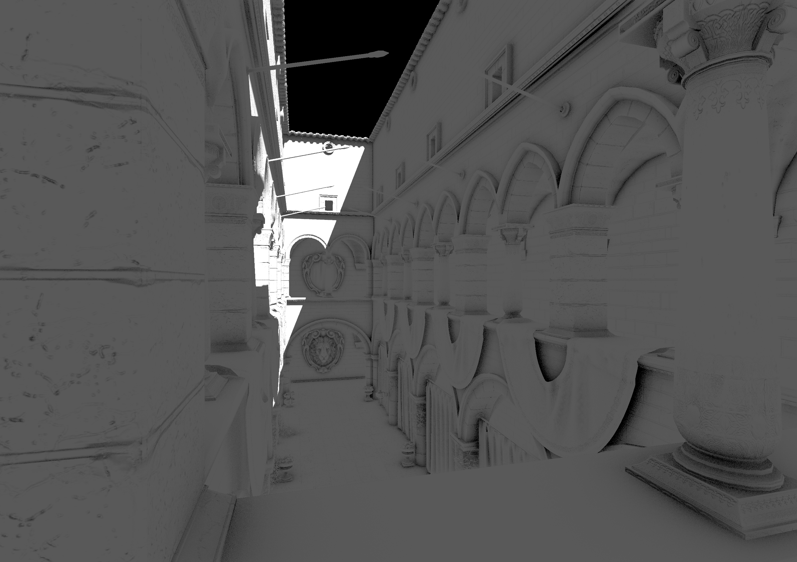

# Vulkan Template

This repository is a base template I use for developing rendering applications and experiments based on Vulkan and C++. I strive to utilize best practices and modern techniques while I learn, but these projects are more for my personal learning of how to practically implement rendering techniques instead of being exemplary snippets in a vacuum.

## Requirements

For now, only Windows is supported, and compilation requires CMake version 3.28 or higher. Most examples are built with a recent version of Vulkan in mind, on an Nvidia GPU, and multiple extensions that do not have widespread adoption.

You must download the [Vulkan SDK](https://vulkan.lunarg.com/). Any recent patch of at least 1.3 should work. This is needed for `vulkan.h`, `glslangValidator.exe`, and a few other debug utilities to be present on the system.

CMake is configured to use FetchContent to pull all of the following dependencies from Github. See [`cmake/dependencies.cmake`](cmake/dependencies.cmake) for the versions in use. Other dependencies are included in `third_party`, and configured manually via CMake.

## Projects

My derivative projects based on this template are present as branches of this repository, with useful changes pulled down for general use. This could lead to a messy git history as maintaining all these changes across many branches is very difficult, but that is not my goal. Instead, I take features as they are needed and use them moving forward instead of keeping every branch up to date.

Each branch contains a unique `README.md` that goes into more detail.

| Branch | Image | Description|
| :---: | --- | --- |
| [`SSAO`](/../../tree/SSAO) |    *Pictured is the [Sponza](https://github.com/KhronosGroup/glTF-Sample-Assets/tree/main/Models/Sponza) model, with colors set to pure white for demonstrative purposes*| Implementation of a modified Screen Space Ambient Occlusion technique. Front-face and back-face GBuffers are produced for a scene. Per frame, one compute pass per GBuffer modulates the single channel AO texture using occluder/occludee world positions. This AO texture is then applied during a deferred lighting pass to attenuate the ambient lighting. A toggleable directional light with shadows drives specular lighting to showcase the ambient lighting. |