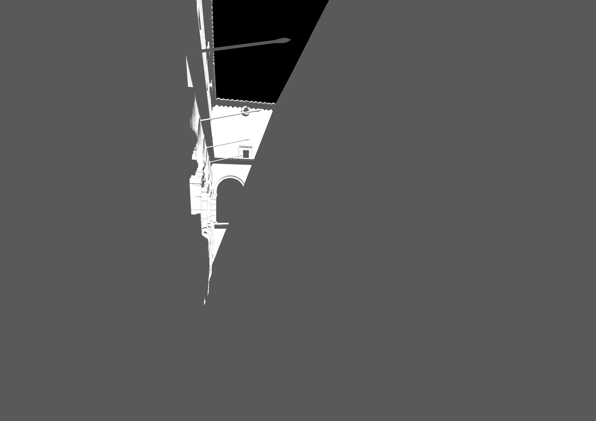

# SSAO

This method starts with generating a GBuffer in [shaders/deferred/gbuffer.frag](./shaders/deferred/gbuffer.vert) and [shaders/deferred/gbuffer.frag](./shaders/deferred/gbuffer.frag). This GBuffer contains color, world position, and normals for the scene. Only opaque geometry is rendered, with one pass for front-face and back-face culling each. 

Then, these gbuffers are passed to two full-screen dispatches of [shaders/deferred/ssao.comp](./shaders/deferred/ssao.comp). One dispatch handles computing the occlusion from the front-faces, and the other the occlusion from the back-faces. These are written into the same AO texture, where the transmittances are summed as attenuations and clamped to be between 0 and 1. This permits a saturation of ambient occlusion due to overcounting between front-face and back-face occluders, but I assumed this was unlikely for most geometry. This does lead to some issues wherever occluding front-faces and back-faces are close together, such as behind a rounded pillar. The worst case scenario is a two-sided polygon, for which both faces produce identical occluders.

I decided to model my occluders as a sphere subtending a certain solid angle, blocking a uniform distribution of ambient light hitting the occludee. Here is an extracted snippet of the important parts of how the contribution of a single occludee sample is calculated:

```
<shaders/deferred/ssao.comp>

    const vec3 v = occluderPosition.xyz - occludee.position.xyz;
    const float d = length(v);

    // The sphere occluder subtends a solid angle from the perspective of the occludee
    const float occluderSolidAngle = 6.28318530718 * (1.0 - d / sqrt(d * d + pc.occluderRadius * pc.occluderRadius));

    // Normally we need to integrate the occluded light over all v towards the sphere, but we can assume v does not
    // vary much so we multiply by a single attenuation factor.
    return clamp(dot(occludee.normal.xyz, normalize(v)) - pc.occluderBias, 0.0, 1.0) * occluderSolidAngle;
```


This ended up being a bit of wasted effort, as compared to just returning some choice of `1.0/d`, `1.0/(d * d)`, `1.0/(1.0 + d)` etc. The idea of modelling an individual occluder in a physically-based manner is nice, but at high sample counts you still over-accumulate occlusion. As expected for a screen-space effect, this forced me to average the samples and add various knobs to tweak the effect and get it to a visibly appealing state, undermining the physically-based intent.

The occluder sampling strategy is N disks of 16 samples, where N varies in a set interval based on the distance from the camera. These 16 samples are distributed in a zig-zag pattern among the four quadrants of a screen-space disk. This is combined with random rotations, achieved by reflecting over samples from a precomputed texture of random normals. The reflection vectors are NOT normalized, which I found to be best. When you normalize these reflection vectors, it turns the reflection into just a rotation. This leads to clear banding artifacts. Similarly, not reflecting/randomizing the samples leads to sampling artifacts where the sampling strategy is obvious. See this comparison, with the AO cranked up to make the effect more obvious:

||
|:-:|
|From left to right: 1) No sampling randomization, 2) sample offsets reflected over random unit vectors, and 3) sample offsets reflected over random non-unit vectors.|

The front-face GBuffer and AO texture are then combined in a deferred lighting pass within [shaders/deferred/light.comp](./shaders/deferred/light.comp). Here I utilized PCF shadowmapping for a directional light that contrasts the ambient occlusion. The ambient occlusion is sampled as a transmittance value that attenuates just the ambient lighting contribution. The final result is pictured below with the [Sponza](https://github.com/KhronosGroup/glTF-Sample-Assets/tree/main/Models/Sponza) model. The directional light is nominally a hundred times brighter than the ambient lighting.

 | 
:-----------------------------:|:--------------------------------:
No Color nor Ambient Occlusion | No Color, with Ambient Occlusion
 | 
With Color, No Ambient Occlusion | With Color and Ambient Occlusion

In the end, the effect is nice, but suffers from many issues. Some points:
- As a screen-space effect, it is very view dependent. Ambient shading will appear and disappear based on the angle the camera views the scene. Geometry that is just offscreen or behind the camera will not cause any occlusion, but moving the camera a slight bit without changing the angle causes the occlusion to pop in now that the occluder information is present. 
- The method only captures occlusion at a short distance, even if the actual directional light is far away. This should be bridged by estimating ambient lighting better based on camera position, but this leads into other global illumination techniques instead of being purely screen-space.
- I implemented a gaussian blur on the AO texture to help cover some of the noise, but I ran into the issues with clobbering object boundaries with large depth discontinuities, so the screenshots above have blurring disabled.
- The random sampling noise pattern is quite visible. This does not have anything to do with SSAO, the sample randomization just needs to be tweaked to be based on world position instead of gbuffer texture coordinate like it is now.

There are many techniques that build on SSAO and address most of the issues I encountered, such as GTAO (see [Jimenez et al. at Siggraph 2016](https://www.activision.com/cdn/research/Practical_Real_Time_Strategies_for_Accurate_Indirect_Occlusion_NEW%20VERSION_COLOR.pdf)). 

The C++ sources containing the implementation of this pipeline are in [GBuffer.cpp](vulkan_template/source/vulkan_template/app/GBuffer.cpp) and [LightingPass.cpp](vulkan_template/source/vulkan_template/app/LightingPass.cpp). The rest of the project's code is auxiliary and based on the `main` branch.

## Sources

- This blog post inspired my implementation:
https://www.gamedev.net/tutorials/programming/graphics/a-simple-and-practical-approach-to-ssao-r2753/
- A great summary of various techniques:
https://www.gamedevs.org/uploads/comparative-study-of-ssao-methods.pdf
- Sascha Willems' great example repository that I referenced many times:
https://github.com/SaschaWillems/Vulkan
- A gaussian blur technique I based mine off of:
https://github.com/powervr-graphics/Native_SDK/blob/master/examples/Vulkan/PostProcessing/ComputeGaussianBlurVerticalShader.csh.template 